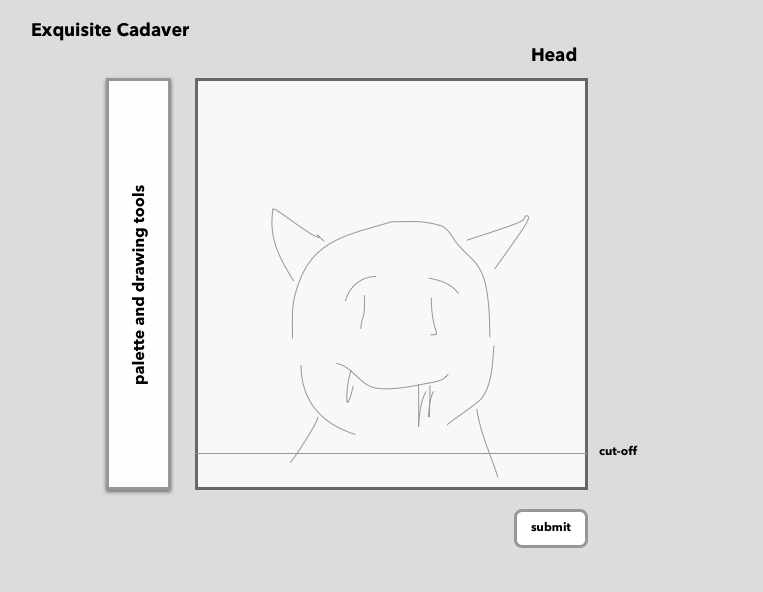

# Exquisite Cadaver

## MVP
When completed, Exquisite Cadaver will be a fully-functional, online version of the drawing game with
the same name.

## Wireframes

## Timeline

* Phase one:
    - create basic ui
    - implement basic canvas drawing functionality
* Phase two:
    - implement saving images
    - game will have multiple stages (head, torso, legs) by end of phase 2
* Phase 3:
    - implement compositing different stages into one corpse
    - polish ui
* Bonus:
  - add backend and social media integration
